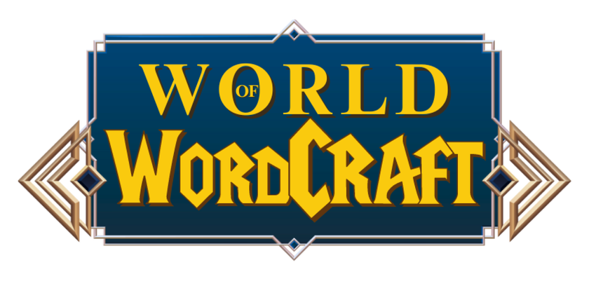

# World of Wordcraft



Welcome to **World of Wordcraft**, a multiplayer game where players combine words to create new ones and compete for the highest score based on word similarity.

## Table of Contents

- [World of Wordcraft](#world-of-wordcraft)
  - [Table of Contents](#table-of-contents)
  - [Features](#features)
  - [Future Improvements](#future-improvements)
  - [Prerequisites](#prerequisites)
  - [Configuration](#configuration)
    - [Setting Up LLaMA](#setting-up-llama)
  - [Acknowledgments](#acknowledgments)

## Features

- **Local Multiplayer:** Connect and play with others over a Local Area Network (LAN) using TCP sockets.
- **Dynamic Scoring:** Earn points based on the similarity between your created words and target words.
- **Language Model Integration:** LLaMA language model for generating words.

## Future Improvements

- **Online Multiplayer Support:** Expand the game to support online play beyond LAN.
- **Better Gameplay:** Enhance the scoring system and gameplay mechanics.
- **Pre-trained Model:** Update the LLaMa model to a pre-trained version for improved word generation.


## Prerequisites

- **Python 3.+**
- **Required Python Packages:**
  - `numpy`
  - `scikit-learn`
  - `pysqlite3`
  - `replicate`
  - `tkinter`

## Configuration

### Setting Up LLaMA

1. **Set Replicate Token via Command Line**
     ```bash
     export REPLICATE_API_TOKEN=your-token-here
     ```

2. **Set Replicate Token in Python Script**
   - Alternatively, add your Replicate API token in your Python script:
     ```python
     import os
     os.environ['REPLICATE_API_TOKEN'] = 'your-token-here'

## Acknowledgments

This game was inspired by the [Infinite Craft](https://neal.fun/infinite-craft/) game. Check it out! 